# Painel Controle - Smartpromo 

Nesta documentação descrevemos as principais funcionalidades do painel de controle da plataforma de marketing promocional digital Smartpromo.

### Links de acesso rápido

- [Dashboard](#dashboard)
- [Quarentena](#quarentena)
- [Consumidores](#consumidores)
- [Notas fiscais](#notas-fiscais)
- [Cupons](#cupons)
- [Pesquisas de satisfação](#pesquisas-de-satisfação)

## Dashboard

Para acessar o dashboard com informações gerenciais, e de performance, da campanha acesse o menu lateral e clique no item 

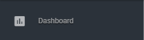

No dashboard você pode tem acesso as informações sumarizadas da campanha numa visão macro, ou por empreendimento participante, como:

* Totais de notas, número de participantes, ticket médio, etc
* Evolução diária da campanha
* Informações de perfil, percentual por gênero, faixa etária, etc
* Percentual de status de notas
* Número de brindes e prêmios em estoque, reservado e entregues

E ainda muito mais! 

> Se precisar de alguma informação adicional fale com um de nossos consultores para avaliarmos e disponibilizarmos os dados que precisa.

#### Contadores
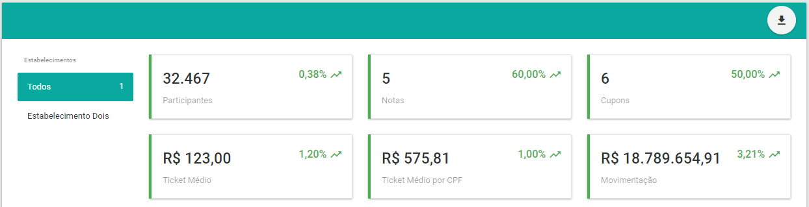

#### Evolução diária
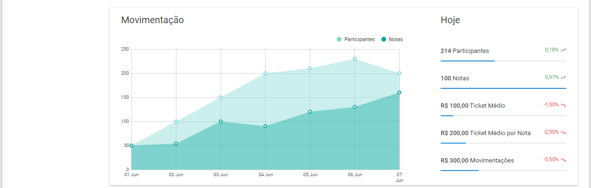

#### Informações de perfil
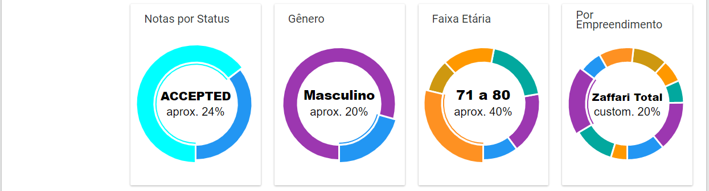

#### Informações de estoque
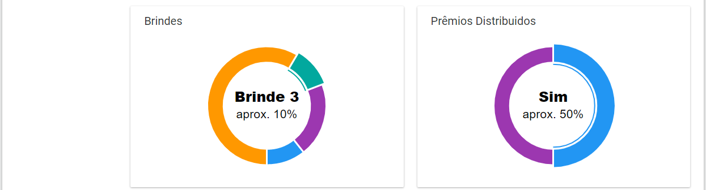


## Quarentena

A quarentena é a área onde notas fiscais que sofreram criticas do sistema Smartpromo, mas que não foram rejeitadas, ficam aguardando por uma revisão manual. 

Alguns exemplos de motivos para notas fiscais ficarem retidas na quarentena são:

* Notas fiscais enviadas por consumidores cadastrados como funcionários ou seus familiares
* Notas fiscais acima de um valor limite
* Notas fiscais de emitentes não aderentes a campanha

> __Algumas destas críticas podem ser desativadas.__ 
>
> Se quiser conhecer a lista completa de criticas, e o impacto na analise das notas fiscais, solicite auxilio a um de nossos consultores.

Para acessar a quarentena de notas fiscais acesse o menu lateral e clique no item 


Na quarentena você tem acesso a todas as informações da nota fiscais, inclusive do motivo pelo qual uma nota fiscal foi marcada para revisão.

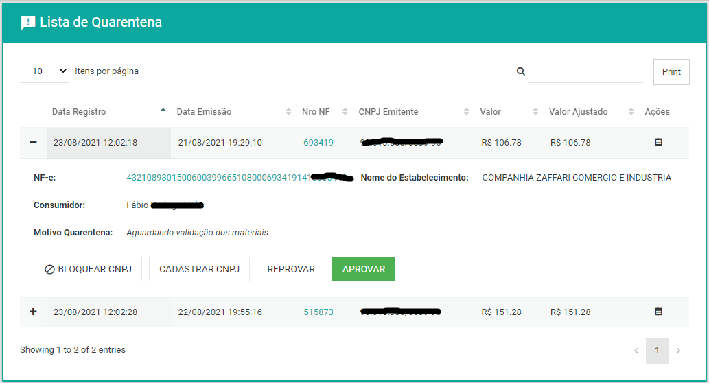

As ações padrão quando uma nota fiscal está em quarentena são ...

* __APROVAR__ a nota, nesse caso a nota fiscal seguirá para a próxima etapa gerando a pontuação e quando o saldo de pontos do consumidor der direito irá gerar cupons, brindes e/ou chances de ganhar prêmios instantâneos de acordo com as regras da campanha.
* __REPROVAR__ a nota, nesse caso será necessário informar um motivo de rejeição (escolhendo em uma lista de motivos) e então a nota será rejeitada. Notas rejeitadas não participam da promoção. 

Existem 2 (duas) ações especiais que tem efeito sobre todas as notas fiscais que estão na quarentena.

* __ CADASTRAR CNPJ__, CNPJ de emitentes não aderentes a campanha podem ser liberados, neste caso, todas as notas fiscais que estavam aguardando a validação por motivo deste mesmo CNPJ serão liberadas em massa.
* __BLOQUEAR CNPJ__, CNPJ de emitentes não aderentes a campanha, que foram verificados e realmente não são aderentes podem ser marcados para que sejam rejeitados sem que seja necessário passar pela quarentena. Essa ação marca o CNPJ como uma exclusão, e rejeita todas as notas deste mesmo CNPJ que estão na quarentena, e as futuras.

 
## Consumidores

Para acessar a gestão de consumidores participantes da campanha abra o menu lateral e clique no item 


Na gestão de consumidores você pode verificar informações vinculadas a cada consumidor, como:

* Informações de optin
* Saldos para resgate de cupons, brindes, etc
* Dados pessoais
* Notas fiscais enviadas e seus status
* Cupons
* Brindes
* Prêmios instantâneos

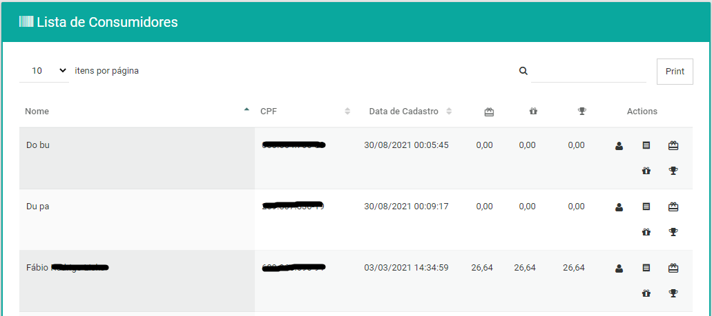

#### Dados pessoais

Você pode acessar e atualizar os dados pessoais de qualquer consumidor.

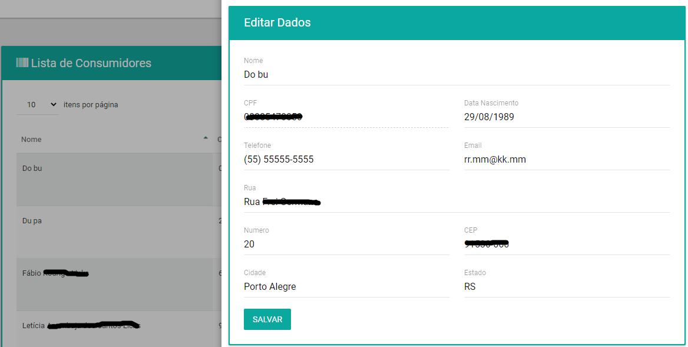

#### Notas fiscais

Você pode acessar e avaliar de uma forma muito simples todas as notas fiscais enviadas por qualquer consumidor.

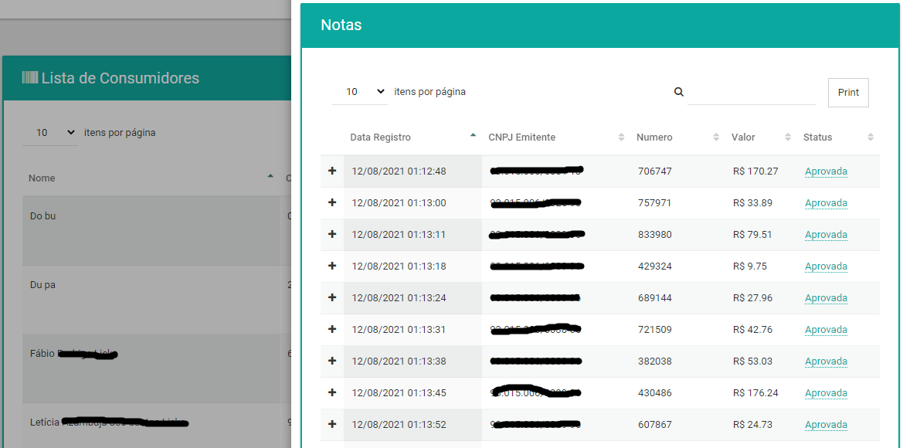

#### Cupons

Você pode acessar e verificar de uma forma muito simples todos os cupons obtidos por qualquer consumidor.

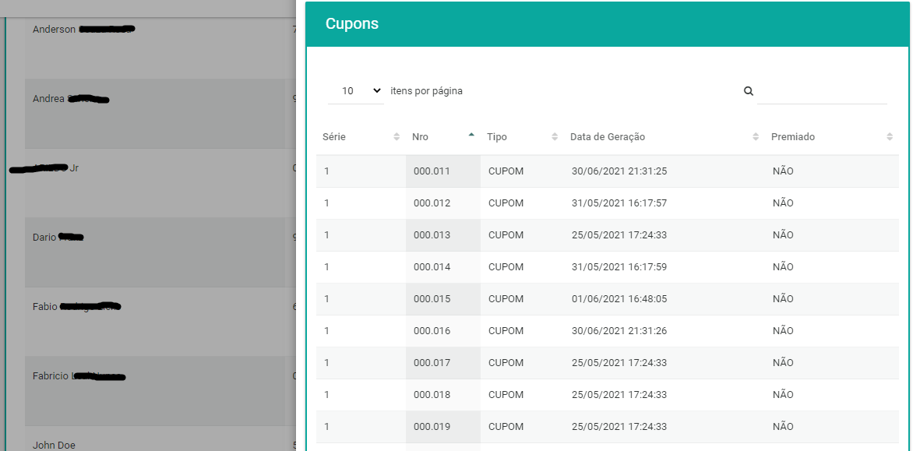

> Algumas campanhas não geram cupons, neste caso essa listagem estará vazia.

#### Brindes

Você pode consultar e efetuar o registro da entrega dos brindes obtidos por qualquer consumidor. 

Para registrar a entrega de um brinde é só clicar no botão com o ícone de um troféu a direita do brinde que está entregando, a data e hora da entrega ficará registrada no sistema Smartpromo. 

> __Importante:__ O registro da entrega de um brinde não pode ser desfeita.


> Algumas campanhas não geram brindes, neste caso essa listagem estará vazia.

#### Prêmios instantâneos

Você pode consultar e efetuar o registro da entrega dos prêmios instantâneos obtidos por qualquer consumidor. 

Para registrar a entrega de um prêmio instantâneo é só clicar no botão com o ícone de um troféu a direita do prêmio instantâneo que está entregando, a data e hora da entrega ficará registrada no sistema Smartpromo. 

> __Importante:__ O registro da entrega de um prêmio instantâneo não pode ser desfeita.

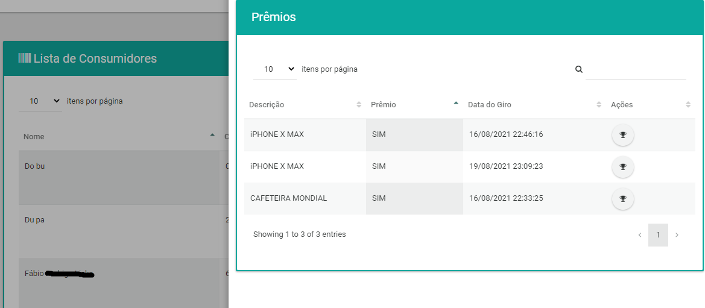

> Algumas campanhas não geram prêmio instantâneo, neste caso essa listagem estará vazia.

## Notas fiscais

Para acessar a gestão de notas fiscais abra o menu lateral e clique no item 


Na gestão de notas fiscais você pode verificar informações resumidas de cada nota fiscal, como: 

* A data e modo de envio
* O status após o processamento da nota
* Os itens da nota
* O emitente da nota
* O consumidor que cadastrou a nota

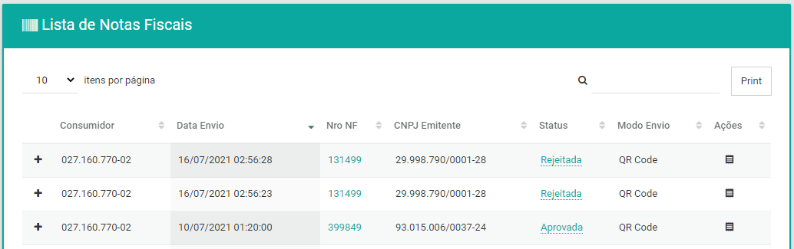

Você tambem pode ter acesso a mais informações e ações sobre a nota fiscal, como:

* Valor total da nota
* Valor ajustado da nota após remoção de itens que não são permitidos   
* Se a nota foi identificada, e o CPF do consumidor
* Link para a nota na sefaz do estado de emissão
* Forçar a aprovação de uma nota fiscal rejeitada

> __ATENÇÃO__: Forçar a aprovação fará com que o sistema ignore todas as criticas e aprove de forma administrativa uma nota para o consumidor que a enviou, mesmo que ela esteja, por exemplo, viculada a outro consumidor também.

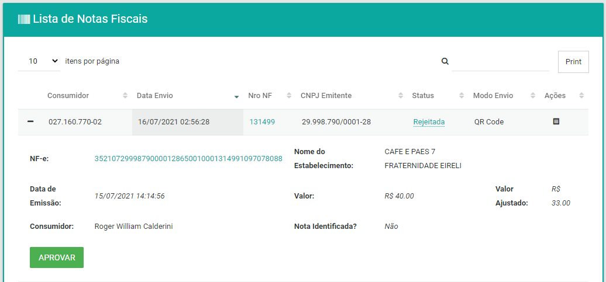


## Cupons

Para acessar a gestão de cupons abra o menu lateral e clique no item 


Na gestão de cupons você pode:

* Verificar informações como a data de geração, consumidor que recebeu o cupom, etc 
* Verificar quais notas fiscais estão vinculadas a cada cupon
* Definir os cupons premiados após a apuração

> A notificação dos consumidores premiados só ocorre após a campanha estar no status de encerrada.

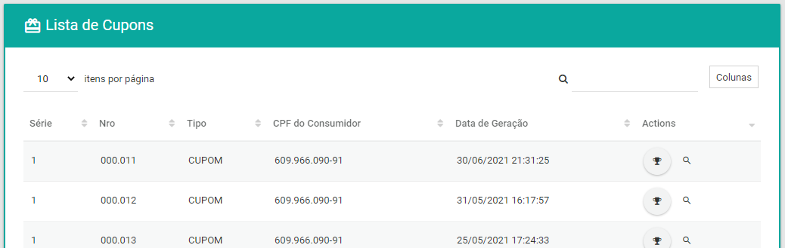

## Pesquisas de satisfação

Você pode criar pesquisas de satisfação (NPS) e/ou opinião. 

> Cada campanha suporta, por padrão, apenas uma pesquisa. Se quiser realizar mais de uma entre em contato com um de nossos consultores para que te auxiliem com isso.

A pesquisa é totalmente configurável. Você pode definir: 

* O __título__ para a pesquisa 
* A __mensagem__ com o convite para o consumidor participar
* O texto de cada um dos __botões__ de ação
* A __mensagem__ na finalização da pesquisa
* As __perguntas__ da pesquisa

A __SDK__ do Smartpromo sempre tentará alertar os consumidores sobre uma pesquisa. Isso quer dizer que a pesquisa sempre terá prioridade de ser apresentada ao consumidor, mesmo que ocorram outras situações que a SDK do Smartpromo tenta alertar o consumidor, como por exemplo quando o consumidor tem direito a um brinde ou a concorrer a um prêmio instantâneo. A ordem de prioridade é:

> Pesquisa de satisfação > Prêmios Instantâneos > Brindes

Veja um exemplo:

```json
{
	"title": "Pesquisa de satisfação",
	"message": "É rápida e vai nos ajudar a aprimorar nossos serviços, bora participar?",
	"questions": [],
	"sent_message": "Muito obrigado por ter participado da nossa pesquisa.",
	"negative_button_title": "Não tenho interesse!",
	"positive_button_title": "Participar"
}
```

### Perguntas do tipo NPS

Um dos principais indicadores de experiência do consumidor é o NPS (Net Promoter Score). Crie uma ou mais perguntas neste estilo em uma pesquisa no Smartpromo e entenda o grau de satisfação do seu consumidor com seus produtos e/ou serviços.

```json
	{
		"options": ["1", "2", "3", "4", "5"],
		"option_answer": "5",
		"option_question": "Qual a chance de você indicar o shopping para seus amigos?",
		"free_text_answer": "",
		"free_text_question": "Conte mais"
	}
```

> Uma pergunta NPS pode ter, ou não, uma segunda pergunta com um campo de edição livre para que o consumidor forneça mais informações.

### Perguntas do tipo fechadas

Você pode criar uma ou mais perguntas fechadas em uma pesquisa no Smartpromo.

```json
	{
		"options": ["Sim", "Não"],
		"option_answer": "",
		"option_question": "Você encontrou o produto que estava procurando?",
		"free_text_answer": null,
		"free_text_question": null
	}
```

> Você também pode adicionar, ou não, uma segunda pergunta com um campo de edição livre para que o consumidor forneça mais informações.

### Perguntas do tipo abertas

Você pode criar uma ou mais perguntas abertas em uma pesquisa no Smartpromo. Perguntas abertas são perguntas em que você dá a oportunidade do consumidor contar sobre alguma experiência fornecendo um feedback.

```json
	{
		"options": null,
		"option_answer": null,
		"option_question": null,
		"free_text_answer": "",
		"free_text_question": "Qual o seu sonho?"
	}
```

A seguir veja um exemplo completo, e se ficou com alguma dúvida, não se preocupe, nossos consultores estão sempre a disposição para auxiliar.

### Exemplo completo
 

```json
{
	"title": "Pesquisa de satisfação",
	"message": "É rápida e vai nos ajudar a aprimorar nossos serviços, bora participar?",
	"questions": [{
		"options": ["1", "2", "3", "4", "5"],
		"option_answer": "5",
		"option_question": "Qual a chance de você indicar o shopping para seus amigos?",
		"free_text_answer": "",
		"free_text_question": "Conte mais"
	}, {
		"options": ["Sim", "Não"],
		"option_answer": "",
		"option_question": "Você encontrou o produto que estava procurando?",
		"free_text_answer": null,
		"free_text_question": null
	}, {
		"options": null,
		"option_answer": null,
		"option_question": null,
		"free_text_answer": "",
		"free_text_question": "Qual o seu sonho?"
	}],
	"sent_message": "Muito obrigado por ter participado da nossa pesquisa.",
	"negative_button_title": "Não tenho interesse!",
	"positive_button_title": "Participar"
}
```

# Agora, boa campanha promocional com Smartpromo!