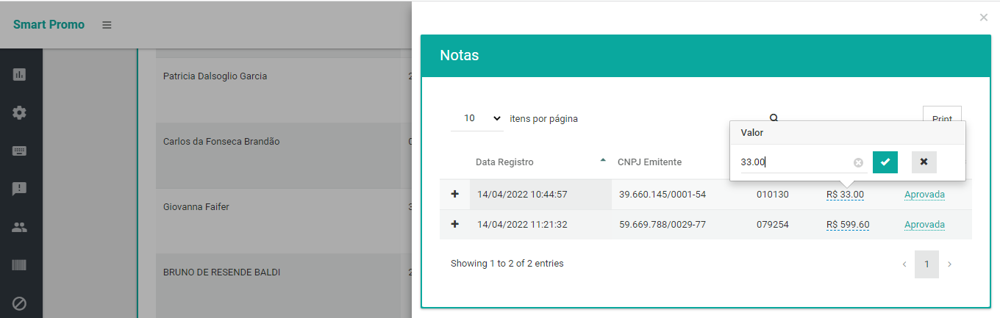
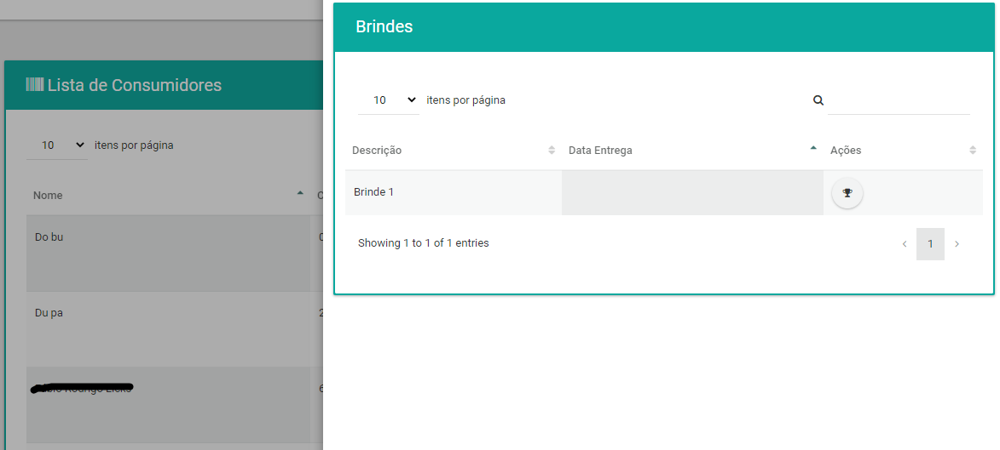
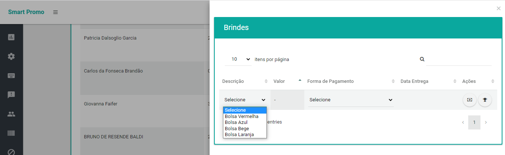
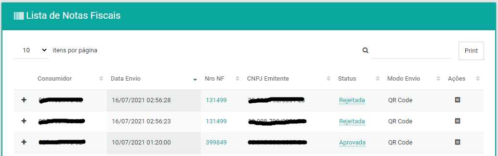
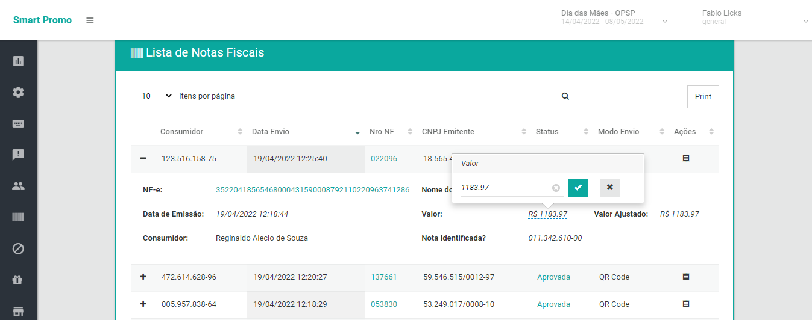
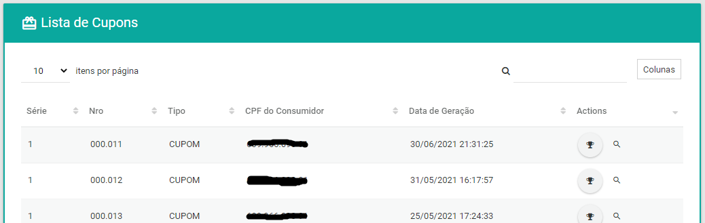

# Painel Controle - Smartpromo 

Nesta documentação descrevemos as principais funcionalidades do painel de controle da plataforma de marketing promocional digital Smartpromo.

### Links de acesso rápido

- [Dashboard](#dashboard)
- [Quarentena](#quarentena)
- [Consumidores](#consumidores)
- [Notas fiscais](#notas-fiscais)
- [Cupons](#cupons)
- [Pesquisas de satisfação](#pesquisas-de-satisfação)

## Dashboard

Para acessar o dashboard com informações gerenciais, e de performance, da campanha acesse o menu lateral e clique no item 


No dashboard você pode tem acesso as informações sumarizadas da campanha numa visão macro, ou por empreendimento participante, como:

* Totais de notas, número de participantes, ticket médio, etc
* Evolução diária da campanha
* Informações de perfil, percentual por gênero, faixa etária, etc
* Percentual de status de notas
* Número de brindes e prêmios em estoque, reservado e entregues

E ainda muito mais! 

> Se precisar de alguma informação adicional fale com um de nossos consultores para avaliarmos e disponibilizarmos os dados que precisa.

#### Contadores


#### Evolução diária


#### Informações de perfil


#### Informações de estoque


## Quarentena

A quarentena é a área onde notas fiscais que sofreram criticas do sistema Smartpromo, mas que não foram rejeitadas, e ficam aguardando por uma revisão manual. 

Alguns exemplos de motivos para notas fiscais ficarem retidas na quarentena são:

* Notas fiscais enviadas por consumidores cadastrados como funcionários ou seus familiares
* Notas fiscais acima de um valor limite
* Notas fiscais de emitentes não aderentes a campanha

> __Algumas destas críticas podem ser desativadas.__ 
>
> Se quiser conhecer a lista completa de criticas, e o impacto na analise das notas fiscais, solicite auxilio a um de nossos consultores.

Para acessar a quarentena de notas fiscais acesse o menu lateral e clique no item 


Na quarentena você tem acesso a todas as informações da nota fiscais, inclusive do motivo pelo qual uma nota fiscal foi marcada para revisão.

> __Dica__: Clicando no CNPJ do emitente da nota fiscal será aberto o site da Receita Federal para que você possa consultar informações a respeito daquele CNPJ e assim decidir se aprova ou não aquela nota fiscal. 


As ações padrão quando uma nota fiscal está em quarentena são ...

* __APROVAR__ a nota, nesse caso a nota fiscal seguirá para a próxima etapa gerando a pontuação e quando o saldo de pontos do consumidor der direito irá gerar cupons, brindes e/ou chances de ganhar prêmios instantâneos de acordo com as regras da campanha.
* __REPROVAR__ a nota, nesse caso será necessário informar um motivo de rejeição (escolhendo em uma lista de motivos) e então a nota será rejeitada. Notas rejeitadas não participam da promoção. 

Existem 2 (duas) ações especiais que tem efeito sobre todas as notas fiscais que estão na quarentena.

* __ CADASTRAR CNPJ__, CNPJ de emitentes não aderentes a campanha podem ser liberados, neste caso, todas as notas fiscais que estavam aguardando a validação por motivo deste mesmo CNPJ serão liberadas em massa.
* __BLOQUEAR CNPJ__, CNPJ de emitentes não aderentes a campanha, que foram verificados e realmente não são aderentes podem ser marcados para que sejam rejeitados sem que seja necessário passar pela quarentena. Essa ação marca o CNPJ como uma exclusão, e rejeita todas as notas deste mesmo CNPJ que estão na quarentena, e as futuras.

 
## Consumidores

Para acessar a gestão de consumidores participantes da campanha abra o menu lateral e clique no item 


Na gestão de consumidores você pode verificar informações vinculadas a cada consumidor, como:

* Informações de optin
* Saldos para resgate de cupons, brindes, etc
* Dados pessoais
* Notas fiscais enviadas e seus status
* Informações sobre Cupons gerados
* Informações sobre Brindes e a realização da baixa 
* Informações sobre os Prêmios instantâneos e a realização da baixa


#### Dados pessoais

Você pode acessar e atualizar os dados pessoais de qualquer consumidor.


#### Notas fiscais

Você pode acessar e avaliar de uma forma muito simples todas as notas fiscais enviadas por qualquer consumidor.


__Dica__: É possível corrigir o valor de uma nota fiscal quando ela foi registrada com valor incorreto no processo de transcrição.



#### Cupons

Você pode acessar e verificar de uma forma muito simples todos os cupons obtidos por qualquer consumidor.


> Algumas campanhas não geram cupons, neste caso essa listagem estará vazia.

#### Brindes

Você pode consultar e efetuar o registro da entrega dos brindes obtidos por qualquer consumidor. 

Para registrar a entrega de um brinde é só clicar no botão com o ícone de um troféu a direita do brinde que está entregando, a data e hora da entrega ficará registrada no sistema Smartpromo. 

> __Importante:__ O registro da entrega de um brinde não pode ser desfeita.



Existe uma campanha especial de brindes chamada de __Spend, Pay and Get__, nesta modalidade você pode dar a baixa no pagamento e posteriormente na entrega do brinde.

Nesta modalidade você pode escolher o brinde, a modalidade de pagamento e registrar o pagamento e entrega.



> Algumas campanhas não geram brindes, neste caso essa listagem estará vazia.

#### Prêmios instantâneos

Você pode consultar e efetuar o registro da entrega dos prêmios instantâneos obtidos por qualquer consumidor. 

Para registrar a entrega de um prêmio instantâneo é só clicar no botão com o ícone de um troféu a direita do prêmio instantâneo que está entregando, a data e hora da entrega ficará registrada no sistema Smartpromo. 

> __Importante:__ O registro da entrega de um prêmio instantâneo não pode ser desfeita.


> Algumas campanhas não geram prêmio instantâneo, neste caso essa listagem estará vazia.

## Notas fiscais

Para acessar a gestão de notas fiscais abra o menu lateral e clique no item 


Na gestão de notas fiscais você pode verificar informações resumidas de cada nota fiscal, como: 

* A data e modo de envio
* O status após o processamento da nota
* Os itens da nota
* O emitente da nota
* O consumidor que cadastrou a nota



Você tambem pode ter acesso a mais informações e ações sobre a nota fiscal, como:

* Valor total da nota
* Valor ajustado da nota após remoção de itens que não são permitidos   
* Se a nota foi identificada, e o CPF do consumidor
* Link para a nota na sefaz do estado de emissão
* Forçar a aprovação de uma nota fiscal rejeitada

> __ATENÇÃO__: Forçar a aprovação fará com que o sistema ignore todas as criticas e aprove de forma administrativa uma nota para o consumidor que a enviou, mesmo que ela esteja, por exemplo, viculada a outro consumidor também.


__Dica__: É possível corrigir o valor de uma nota fiscal quando ela foi registrada com valor incorreto no processo de transcrição.



## Cupons

Para acessar a gestão de cupons abra o menu lateral e clique no item 


Na gestão de cupons você pode:

* Verificar informações como a data de geração, consumidor que recebeu o cupom, etc 
* Verificar quais notas fiscais estão vinculadas a cada cupon
* Definir os cupons premiados após a apuração

> A notificação dos consumidores premiados só ocorre após a campanha estar no status de encerrada.



## Pesquisas de satisfação

Você pode criar pesquisas de satisfação (NPS) e/ou opinião. 

> Cada campanha suporta, por padrão, apenas uma pesquisa. Se quiser realizar mais de uma entre em contato com um de nossos consultores para que te auxiliem com isso.

A pesquisa é totalmente configurável e ela é dividia por páginas, sendo que cada página pode ser dividida por seções. Em cada página você pode definir: 

* O __título__ da página
* A __mensagem__ da página
* Para a primeira página sem perguntas, uma __animação__
* O texto de cada um dos __botões__ de ação

Em cada seção você pode definir:
* O __título__ da seção
* As __perguntas__ da seção


| | | 
| --- | --- |
|  |  |


A __SDK__ do Smartpromo sempre tentará alertar os consumidores sobre uma pesquisa. Isso quer dizer que a pesquisa sempre terá prioridade de ser apresentada ao consumidor, mesmo que ocorram outras situações que a SDK do Smartpromo tenta alertar o consumidor, como por exemplo quando o consumidor tem direito a um brinde ou a concorrer a um prêmio instantâneo. A ordem de prioridade é:

> Pesquisa de satisfação > Prêmios Instantâneos > Brindes

Veja um exemplo:

```json
{
  "pages": [
    {
      "message": {
        "title": "Pesquisa de satisfação",
        "body": "É rápida e vai nos ajudar a aprimorar nossos serviços, bora participar?",
        "primary_action": "Participar",
        "secondary_action": "Não tenho interesse!"
      }
    },
    {
      "message": {
        "title": "Página 1 de 2",
        "primary_action": "Próximo"
      },
      "sections": [
        {
          "title": "Título da seção 1",
          "questions": []
        },
        {
          "title": "Título da seção 2",
          "questions": []
        }
      ]
    },
    {
      "message": {
        "title": "Página 2 de 2",
        "primary_action": "Concluir"
      },
      "sections": [
        {
          "title": "Título da seção 1",
          "questions": []
        }
      ]
    },
    {
      "message": {
        "title": "Enviado!",
        "body": "Muito obrigado por ter participado da nossa pesquisa.",
        "primary_action": "Fechar"
      }
    }
  ]
}
```

### Tipos de perguntas

Existe uma variedade de tipos de perguntas que podem ser criadas, porém todas elas tem esses recursos:
* O __título__ da pergunta (opcional)
* Uma __resposta__ pré preenchida (opcional)
* Uma __resposta obrigatória__, onde o botão de avançar da página fica bloqueado até que o usuário acerte a resposta (Opcional)
* Uma __imagem__ (Opcional)

Veja um exemplo:
```json
{
  "title": "Pergunta com escolha múltipla horizontal com imagem?",
  "answer": ["3"],
  "required_answer": ["1"],
  "image": "https://imagem.png"
}
```

#### Perguntas se seleção única horizontal

Esse tipo de pergunta é muito útil para criar uma pergunta NPS.
Um dos principais indicadores de experiência do consumidor é o NPS (Net Promoter Score). Crie uma ou mais perguntas neste estilo em uma pesquisa no Smartpromo e entenda o grau de satisfação do seu consumidor com seus produtos e/ou serviços.

Veja um exemplo:  


```json
{
  "type": "SINGLE_TOGGLE",
  "options": ["1", "2", "3", "4", "5"]
}
```

#### Perguntas de seleção múltipla horizontal

Utilizando o mesmo componente anterior, porém agora com a possíbilidade de multiplas escolhas.

Veja um exemplo:  


```json
{
  "type": "MULTI_TOGGLE",
  "options": ["1", "2", "3", "4", "5"]
}
```

#### Perguntas de seleção única vertical

Similar com a primeira opção, porém agora permitindo uma quantidade de texto maior.

Veja um exemplo:   


```json
{
  "type": "SINGLE",
  "options": ["Não", "Sim"]
}
```

#### Perguntas de seleção múltipla vertical

Similar com a opção horizontal, porém agora permitindo uma quantidade de texto maior.

Veja um exemplo:   


```json
{
  "type": "MULTI",
  "options": ["Email", "Telefone", "SMS"]
}
```

#### Perguntas de verdadeiro ou falso

Essa outra opção de pergunta pode ser usada para criar perguntas onde o usuário precisa aceitar algo, como um termo.


Veja um exemplo:   


```json
{
  "type": "BOOLEAN",
  "title": "Pergunta com apenas Verdadeiro ou Falso como resposta e <a href=\"https://link.com\">link</a>?"
}
```


#### Perguntas de texto livre

Caso o que você precise seja algo mais dinâmico, temos a opção de perguntas de texto livre

Veja um exemplo:  


```json
{
  "type": "TEXT"
}
```
  
    
    

# Agora, boa campanha promocional com Smartpromo!
