# Manual de uso do painel de controle - Smartpush

Nesta documentação descrevemos as principais funcionalidades do painel de controle da plataforma de engajamento e marketing digital Smartpush.

### Links de acesso rápido

- [Dashboard](#dashboard)
- [Galeria](#galeria-de-imagens)
- [Singlelink](#singlelink)
- [Apps](#apps)
- [Tags](#tags)
- [Grupos](#grupos)
- [Geozones](#geozones)
- [Autopush](#autopush)
- [Adhoc](#adhoc)
- [Dinâmicos](#dinamicos)
- [Histórico de Push](#historico-de-push)
- [Push Presets](#push-presets)
- [Alertas](#alertas)
- [Relatórios](#relatorios)

## Dashboard 

No __dashboard__ você tem acesso a informações gerenciais, e de performance, como:

- Volume de inscritos (optin)
- Volume de cancelamentos (optout)
- Volume de push
- Volume de eventos (envios, entregas, visualizações, cliques/aberturas)

Para acessar o __dashboard__ abra o menu lateral, então localize e clique no item 

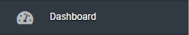

## Galeria de Imagens

A __galeria de imagens__ simplifica o processo de publicação dos banners para você utilizar nos push.

Para acessar a __galeria de imagens__ abra o menu lateral, então localize e clique no item 

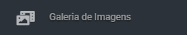

A publicação das imagens na galeria é muito simples, basta arrastar e soltar as imagens que deseja publicar na area de upload.

> Dica: você pode arrastar de uma só vez todas as imagens que deseja publicar.

Após o carregamento das imagens ser concluido você verá o preview da imagem e o link (URL) de acesso de cada uma das imagens.

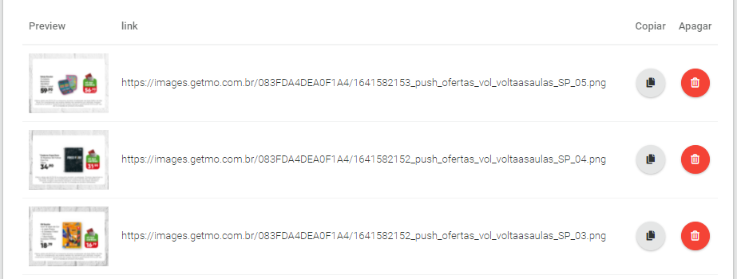

> __Importante__: As imagens na galeria ficam disponíveis por 7 dias. Após esse período as imagens são apagadas automaticamente. 
> 
> Se precisar de períodos maiores de disponibilidade entre em contato conosco para a contratação, ou considere armazenar as imagens em uma cdn própria. 

## Singlelink

__Singlelink__ é um conjunto de soluções para a configuração de links. Você pode criar links encurtados, e tambem links inteligentes que modificam seu comportamento a partir da origem da navegação.

Para acessar as funcionalidades do __Singlelink__ abra o menu lateral, então localize e clique no item 

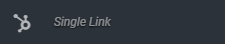

Você terá a opção de configurar um __shortlink__ ou um __deeplink__.

### Shortlink

São links encurtados. Você pode utilizar um dominio personalizado, ou não. Os links encurtados são editáveis, ou seja você pode alterar a URL de destino a qualquer momento.  além disso fornecemos informações sobre cliques no link encurtado como:

- Quantidade de cliques
- Plataformas de origem do clique

E ainda é possivel configurar parâmetros e controlar se o trafego gerado pelo link veio de uma campanha especifica veiculada por __email__, __sms__, ou qualquer outra origem que você definir.

### Deeplink

São links inteligentes que modificam seu comportamento dependendo da origem da navegação. 

Utilizando um __deeplink__ você pode fornecer um link único aos seus usuários que irá atender a todos os cenários a seguir:

- Navegação iniciada a partir de um browser em um computador, o link irá direcionar o usuário para uma landing page.
- Navegação iniciada em um dispositivo android em que a sua app não está instalada, o link irá direcionar o usuário para a página de detalhes do seu aplicativo na Google Play. 
- Navegação iniciada em um dispositivo android em que a sua app está instalada, o link irá abrir a sua aplicação e você poderá levar o usuario direto para uma funcionalidade especifica. 
- Navegação iniciada em um dispositivo iOS em que a sua app não está instalada, o link irá direcionar o usuário para a página de detalhes do seu aplicativo na App Store. 
- Navegação iniciada em um dispositivo iOS em que a sua app está instalada, o link irá abrir a sua aplicação e você poderá levar o usuario direto para uma funcionalidade especifica. 

Tudo isso a partir de um único link! Para aprender como configurar um deeplink clique [aqui]()!

## Apps

Para chegar na galeria de imagens acesse o menu lateral e clique no item 

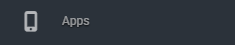

Você pode usar a galeria de imagens para hospedar as imagens dos banners que irá utilizar nos push. 

## Tags

Para chegar na galeria de imagens acesse o menu lateral e clique no item 

Você pode usar a galeria de imagens para hospedar as imagens dos banners que irá utilizar nos push. 

## Grupos

Para chegar na galeria de imagens acesse o menu lateral e clique no item 

Você pode usar a galeria de imagens para hospedar as imagens dos banners que irá utilizar nos push. 

## Geozones

Para chegar na galeria de imagens acesse o menu lateral e clique no item 

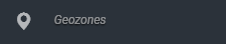

Você pode usar a galeria de imagens para hospedar as imagens dos banners que irá utilizar nos push. 

## Autopush

Para chegar na galeria de imagens acesse o menu lateral e clique no item 

Você pode usar a galeria de imagens para hospedar as imagens dos banners que irá utilizar nos push. 

## Adhoc

Para chegar na galeria de imagens acesse o menu lateral e clique no item 

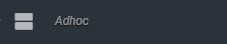

Você pode usar a galeria de imagens para hospedar as imagens dos banners que irá utilizar nos push. 

## Dinâmicos

Para chegar na galeria de imagens acesse o menu lateral e clique no item 

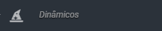

Você pode usar a galeria de imagens para hospedar as imagens dos banners que irá utilizar nos push. 

## Histórico de Push

Para chegar na galeria de imagens acesse o menu lateral e clique no item 

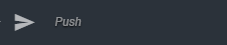

Você pode usar a galeria de imagens para hospedar as imagens dos banners que irá utilizar nos push. 

## Push Presets

Para chegar na galeria de imagens acesse o menu lateral e clique no item 

Você pode usar a galeria de imagens para hospedar as imagens dos banners que irá utilizar nos push. 

## Alertas

Para chegar na galeria de imagens acesse o menu lateral e clique no item 

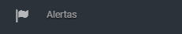

Você pode usar a galeria de imagens para hospedar as imagens dos banners que irá utilizar nos push. 

## Relatórios

Para chegar na galeria de imagens acesse o menu lateral e clique no item 

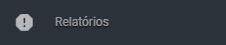

Você pode usar a galeria de imagens para hospedar as imagens dos banners que irá utilizar nos push. 

